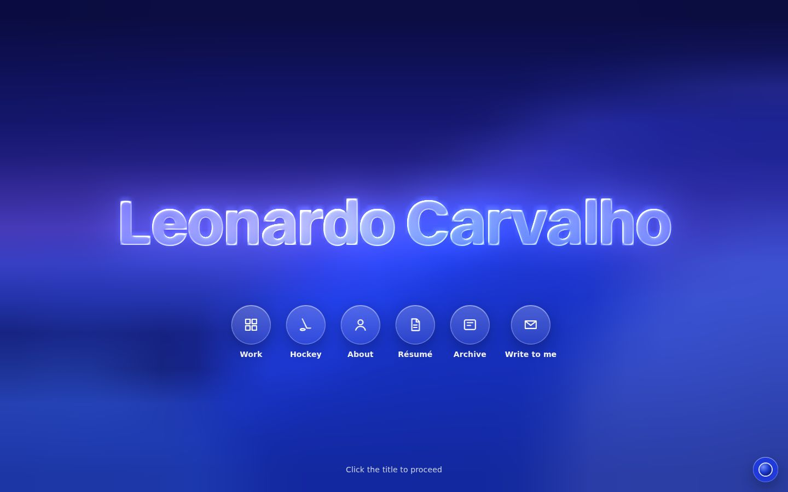
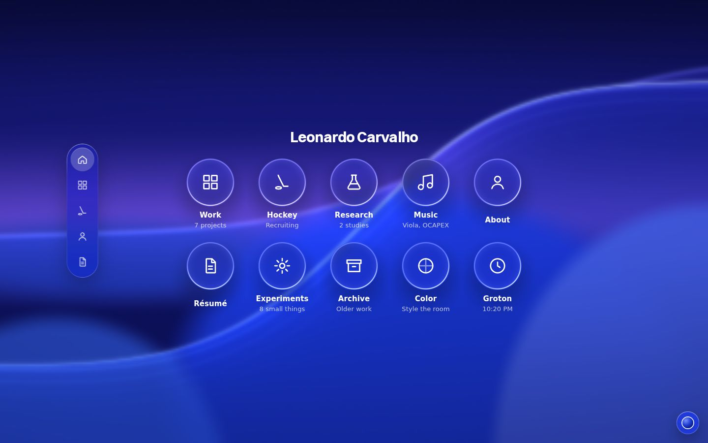
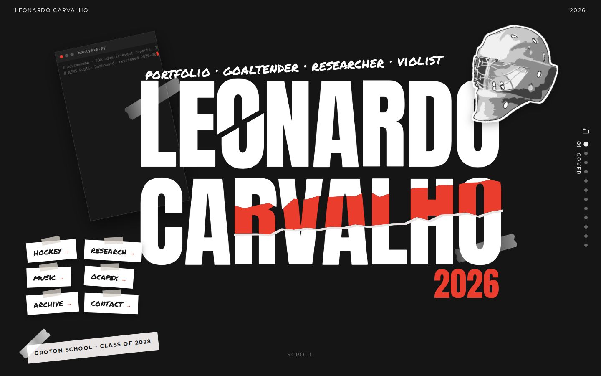
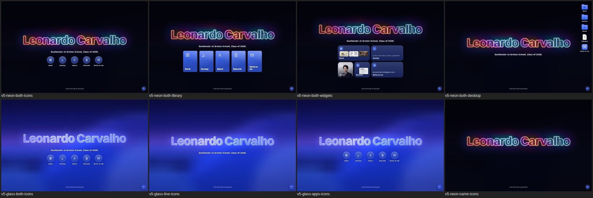
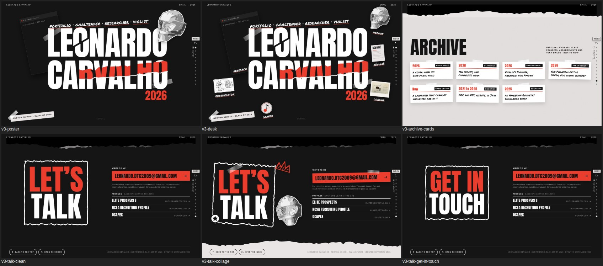

# Round three: refining the finalists, v3 and v5

Written 2026-10-03, after round two shipped (`d0e22b5`). This round improves design and organization only; wording waits until one edition is chosen. It answers five requests from Leonardo:

- list what worked in some editions and not in others;
- track the design elements he named and lay out how each edition can match them;
- optimize v3 and v5 for general audiences;
- list the questions that depend on his taste;
- suggest a method for a desktop with "apps", like myos.framer.website, if it improves organization, adds personality or serves the site's purpose.

**Evidence.** Five research passes ran over the code and the built pages:

- a tracker of every element he named;
- a gap analysis per finalist with audience walkthroughs;
- a criterion-by-criterion study of all five editions;
- a review of desktop and "OS" portfolios;
- a critic who checked the others.

Measurements come from headless Chromium at 1440×900, 1280×800, 1024×620 and 390×844. WebGL ran in software, so motion was judged frame by frame, never by speed. Where this document corrects `foundation.md` or the decision matrix, the correction is listed in [section 8](#8-corrections-to-earlier-documents).

Contents:

1. [What worked where](#1-what-worked-where)
2. [Leonardo's design elements, tracked](#2-leonardos-design-elements-tracked)
3. [Rules that settle the conflicts](#3-rules-that-settle-the-conflicts)
4. [The desktop and "apps" idea: recommended method](#4-the-desktop-and-apps-idea-recommended-method)
5. [The v5 hero](#5-the-v5-hero)
6. [Backlog, in priority order](#6-backlog-in-priority-order)
7. [Taste questions](#7-taste-questions)
8. [Corrections to earlier documents](#8-corrections-to-earlier-documents)
   - [The adversarial review, and what it changed](#8b-the-adversarial-review-and-what-it-changed)
9. [Scores](#9-scores)

---

## 1. What worked where

Each criterion gives the edition that did it best, what fell short, the rule the finalists take from it, and what that means for v3 and v5.

### Animation and motion

- **Worked:**
  - **v4: hovers that move content inside a still frame.** A tile's image rests at 1.05 and settles to 1 over 800 ms. The corner arrow grows from 0.8 and turns from 45° over 450 ms, and the caption brightens. All of it runs on `cubic-bezier(.22,1,.36,1)`, and the 44 px rounded frame never moves.
  - **v4: experiments that open.** The line unfolds with `grid-template-rows` 0fr→1fr over 500 ms while the other rows step back.
  - **v4: record rows.** A row leans 6 px and its siblings drop to 55%.
  - **v3: page-level motion.** Sheets slide over each other through torn edges, and the covered one recedes to 0.95 and dims.
  - **v5: one spring model on one frame loop.** Everything that carries text is critically damped.
- **Fell short:**
  - Round one of v5 blurred incoming text and drifted windows with the pointer, which is what Leonardo called disorienting. Round two removed it.
  - v5 cards grow the whole frame on hover, the opposite of v4's still frame.
  - v3's hovers are short colour changes (150 to 240 ms).
  - A v3 jump to a far sheet scrolls through every sheet in between: 6,300 px from the cover to Hockey.
- **Rule:**
  - Hovers move content inside a still frame, over 450 to 800 ms, on a steep ease-out.
  - Arrivals take 150 to 300 ms with 8 px of travel or less.
  - Only what steps back may change; never blur the item being read or anything in motion.
  - "Creamy" comes from duration and where the motion happens, not from the curve. v3's own curve is nearly identical to v4's.
- **v3:** paper settles under its tape (cards, archive cards). A long jump becomes a cut plus one sheet sliding over.
- **v5:** the screenshot settles inside the card, rows lean, and experiments open while the others dim.

### UI/UX and visual craft

- **Worked:**
  - **v2:** readable measure (66 characters) and hierarchy.
  - **v4:** one restrained system with three ink strengths, four radii and one shadow, and no contrast failures.
  - **v5:** concentric radii and capsule controls, text on fills rather than on a second glass layer, and every control 44 px or more.
  - **v3:** strong in-sheet hierarchy (Anton title, vermilion subtitle, kicker, lede).
- **Fell short:**
  - **v3 contrast:** small white text on vermilion measures 4.03:1 in 31 places, against its own README's rule of black text on vermilion.
  - **v3 cover code:** the panel's text is 9 px.
  - **v3 cabinet:** the file's "Open the sheet" line looks clickable but opens a different sheet.
  - **v3 contact sheet:** the hand-drawn frame around LET'S TALK is clamped by a global `max-width`, so the words stick out.
  - **v5:** side windows hide 30 to 225 px of content with no scroll cue.
- **Rule:** one ink scale; every text pair measured at 4.5:1 or better; nothing with letters under 12 px; nothing that looks clickable and isn't.

### Creativity and originality

- **Worked:** v1, v3 and v5 each carry one metaphor all the way down, including the navigation:
  - v1: the shell prompt.
  - v3: torn paper, tape and a file cabinet.
  - v5: every element is a window, an ornament or a control.
- **Fell short:** v4's parts are named after the sites they came from; v2 is a standard template.
- **Rule:** every borrowed mechanism is rebuilt in the finalist's own material, and the navigation is made of that material too. Nothing should read as a Framer template.

### Ease of use and access

- **Worked:**
  - v2 needs no instruction: a labelled nav and a search on ⌘K or `/`.
  - v1 has the deepest accessibility engineering.
  - v5 scrolls the front window from anywhere and degrades to a labelled bar without scripts.
  - v3's cabinet works well from the keyboard (arrows, Home, End, Escape).
- **Fell short:**
  - v3's index lives at the screen edge with nothing pointing to it, and its targets are 22 px tall (WCAG 2.5.8 asks for 24).
  - v5's tab names appear only on hover.
  - The v5 hero responds to click, tap and Return, but a wheel, Down Arrow or Space does nothing.
  - v5's tab bar comes after the content in the source: 41 Tab presses to reach it.
- **Rule:** every way forward has a visible label, a target of at least 24 px (44 on touch), a keyboard path and a reduced-motion version.

### Organization and wayfinding

- **Worked:**
  - **v2: the complete architecture.** Work index with filters, project templates with a fact strip, a hockey page, a résumé rail that follows the reader, and search.
  - **v4: three audiences at three speeds.** Home curates, and sub-pages go deep.
  - **v5:** location always visible (the tab bubble, window titles, sheets over their parent).
  - **v3:** a fitting index (the cabinet) and a current-sheet label.
- **Fell short:**
  - v3 shows no labelled destinations at rest, and seven links leave for v2.
  - v5 tab icons are unlabelled at rest.
  - Below 1360 px, v5 appends the side window after all the main content: Hockey's Measurables sit 3,229 px down a phone.
  - v5's Résumé "Sections" never marks where you are.
- **Rule:** labelled destinations visible at rest, a "you are here" at every width, any item within two actions, and no project depth borrowed from another edition.

### Personality: design

- **Worked:**
  - v3: the sliced O, the torn red strip, the mask sticker and the hand lettering. The strongest point of view in the set.
  - v5: the glass name lit from behind, and a room every pane frosts.
  - v1: scanlines and the ASCII name.
  - v4: the static and the glow on the name.
- **Fell short:** v4 was "bland" by the family's verdict: its personality is ambient, not authored.
- **Rule:** exactly one ambient "living" detail at 10% strength or less, plus objects only this person could have. v3's living detail is the code panel typing his code; v5's is the room. Neither needs a second.

### Personality: personal use

- **Worked:**
  - v1: games and a name that restyles when clicked.
  - v3: the Archive of index cards. Adding one means copying one `<li>`.
  - v4: the experiments index.
  - v5: the colour style control.
- **Fell short:** v5 has no archive and nothing to play with; v3's archive cards don't open.
- **Rule:** Leonardo can add a personal item by copying one block, with the design coming from CSS.

### Design potential

- **Worked:**
  - v4 and v2 heroes state the role.
  - v1 and v5 heroes carry a hint line.
  - v3's archive takes new items in one block.
  - v4 and v5 record their systems in `DESIGN.md`.
- **Fell short:**
  - Adding a v3 sheet means about 17 hand edits (counts, centring maths).
  - Twelve v5 pages each repeat the tab bar, and about 33 KB of unused hello files remain.
- **Rule:** a new section is one block plus derived counts, with a short "how to add" next to every repeatable block.

### Audience fit (coaches, admissions)

Measured paths from the landing page:

| | Hockey stats | Email | One-page hockey print |
|---|---|---|---|
| v2 | 1 click | footer | 1 page |
| v4 | 1 click | menu, every page | 1 page |
| v5 | 2 on first visit (title, then an unlabelled icon), 1 after | toolbar, 4 of 12 pages | 1 page |
| v3 | hover the edge plus 1 click, or scroll 7 sheets | sheet 12 only | 14 pages |

- **Rule:** position, school and year are on the first screen; hockey is one labelled action away; contact is always reachable; the hockey profile prints on one page.
- A coach who arrives through a direct link never sees a hero or cover: `/v5/hockey/` opens on the stats. So **the URL on his recruiting profiles matters more than the home page** (taste question T3).

### Phone experience

- **Worked:** v2 reads as a plain document; v4 shows experiment lines on touch; v5's floating dock is always visible.
- **Fell short:**
  - v3's only phone navigation is a faint 44 px icon with no "you are here", and its chrome runs over text.
  - v5's dock is icons only, its labels hidden.
  - On a v5 phone, coach material sits 6 swipes down.
- **Rule:** every hover-only reveal gets a resting or tap equivalent, and "where am I" stays on screen.

### Performance and reach

- **Measured home pages:**
  - v5: 315 to 383 KB, plus WebGL2;
  - v4: 342 KB;
  - v3: 302 KB on load, 503 KB after scrolling;
  - v1: 489 KB;
  - v2: 683 KB.
- **Fell short:** v5 never falls back to its still image on a weak device, and its springs slow down below 20 fps.
- **Rule:** no perpetual loop without a budget; a slow device falls back to the still.

### Maintainability

- **Worked:**
  - v3's archive how-to comment;
  - v2's generated search index with a check mode;
  - v4 and v5's `DESIGN.md`;
  - v5's tests.
- **Fell short:** v3's hand-typed counts; v5's 12 copies of the chrome and its three dead files.
- **Rule:** derive counts and chrome from content, and keep a one-paragraph "how to add X" beside every repeatable block.

---

## 2. Leonardo's design elements, tracked

Every element he named, where it stands in each finalist, and how each can match it. "This round" says what was built in this round; ❓ marks a question in [section 7](#7-taste-questions).

### Motion and hover

| Element, in his words | v3 now | v5 now | How v3 matches | How v5 matches | This round |
|---|---|---|---|---|---|
| "The movement of the UI can be disorienting, as the text and UI can become blurred" | Nothing blurs; long jumps travel 6,300 px | Fixed in round two: no blur, windows still | A long jump cuts to the sheet before the target, then one sheet slides over | Keep | v3 jump |
| Animations "smooth, sensible, interactive ... like Apple or iOS" (v5 brief) | Own ease curve | One spring model, critically damped | v4's 450 to 800 ms ease on every hover | Keep | — |
| "The hover effects ... are smooth and creamy (image shape, subtitles, arrow, zoom)" (v4) | Cards and archive cards have no hover | Card grows 1.02, nothing settles | Image settles 1.06→1 inside its frame, arrow badge grows and turns, caption brightens, the other card dims | Screenshot settles 1.05→1 inside the card, arrow grows and turns, subline brightens | Both ❓T2 |
| Experiments "open on hover", "the UI expansion and blur" (v4) | Archive cards are static | Rows only gain a fill | Archive cards unfold their line and straighten; the others dim | Titles at rest; the line unfolds; the others dim | Both ❓T1 |
| "Alta's settle on the tiles instead of a tilt"; "no hover tilt" (v5) | Nothing settles | Grows instead of settling | Straightening a tilted card is a settle | Settle replaces the grow | Both ❓T20 |
| "Cleaner microinteractions in the record" (v4) | Record items aren't links | Rows fill only | Later, if record items become links | Row leans 4 px; its group steps back to 55% | v5 |
| "Many subtle animation effects" (v4) | Present | Thin | Covered by the hovers above | Covered by the hovers above | Both |
| "Page transitions" (v4) | Sheets slide over each other | 140/220 ms crossfade | Plus a file rising over the deck | Keep | v3 files |

### Material, type and the hero

| Element, in his words | v3 now | v5 now | How v3 matches | How v5 matches | This round |
|---|---|---|---|---|---|
| "The background static adds a bit of life" (v4) | Still paper grain | None (the room's drift) | Keep still: the typing code panel is the living detail | None: the room is the living detail | ❓T5 |
| Neiden's bottom-edge blur | n/a | A fade, no blur | — | Keep the fade: a blur band would blur moving text | — |
| "Apple Vision style ... liquid glass UI and clean styling" | n/a | Present | — | Keep | — |
| His real, colourful screens inside Apple devices (v4 brief) | Taped prints | Screens on colour cards | Not needed in the poster language | Optional thin device bezel | ❓T31 |
| "The big text (font) from v4, or other similar blocky text" for the hero | n/a | Switzer 780 as glass | — | Kept; the bevel softens the corners | Hero |
| "Liquid Glass or metallic form, glowing from behind" | n/a | Glass lit from behind | — | Becomes the Glowtime light (section 5) | Hero |
| "A subtle interaction" | Code panel pauses on hover | Light leans toward the pointer (faint) | — | Part of the Glowtime work | Hero |
| "Click the title to proceed", "a clean transition" | n/a | Present | — | Keep; scrolling to enter is a question | ❓T26 |
| "With a reload for dev purposes, allow it to bring back the hero" | n/a | **Done** (`93be48c`) | — | A reload of home shows the hero; `?nohello` skips it | Done ❓T28 |
| "The title effects and style to have the feel from the image [It's Glowtime], but animated and smooth" | n/a | Built: neon flow (section 5) | — | Three prototypes, judged (section 5) | Hero |
| Not "Apple's hello or cursive text" | Hand face is the deck's own | Present | — | — | — |

### Organization and navigation

| Element, in his words | v3 now | v5 now | How v3 matches | How v5 matches | This round |
|---|---|---|---|---|---|
| "The organization is solid" (v4) | Project depth lived in v2 | Present | Own project files in poster form | Keep | v3 files |
| "The lack of guidance may make it difficult for the user to click to what they are looking for" (v3) | Rail label and cabinet | Icons, labels on hover | Cover routes, an Index tab, a phone pill reading "Index · 08 Goaltender", Find | Labels at rest where they fit; labelled dock on phones and touch tablets | Both ❓T8 T21 |
| "Hovering on the dots would bring up the file system" | Present | n/a | Keep | — | — |
| "The popups should be files coming out of the folders" | Present, but the file is a false target | n/a | The file becomes clickable with hover intent | — | v3 ❓T9 |
| "A UI on the page rather than a full window extension" | Present | n/a | Keep | — | — |
| "An archive for personal purposes" | Archive sheet, 8 cards | None | Cards that open | Archive window, or app (section 4) | v3 ❓T7 |
| "The 'let's talk' section and bottom of the page are also not great" | Rebuilt in round two; frame clamped | n/a | Fix the frame clamp | — | v3 ❓T18 |
| Tab bar "slightly off the edge of the main block" | n/a | Present (14 px) | — | Keep | — |
| "The 'Now' UI on the left can be removed ... two blocks" | n/a | Present | — | Side windows hold only what fits | v5 |
| "More space" (v4) | Short windows compress type | Present | Let the record run tall | Keep | — |
| "No numbers on the landing" (v4) | Present | Present | Keep | Keep; no counts on app icons | ❓T36 |
| "A desktop type setup with 'apps'" | Absent | Absent | Routes, Find and files as windows | A Home View launcher | Proposed (section 4) |
| An edition never links to another | Seven links to v2 | Present | Replaced by v3's own files | — | v3 files |

### Elements from his approved v5 spec that the method must respect

- The window bar can be dragged 40 px and springs back, as "a harmless visionOS nod" (spec line 54).
- **Out of scope, his choice:**
  - sound;
  - a custom cursor;
  - 3D models;
  - windows that really move;
  - a light/dark toggle;
  - room tints per project.
  These bear directly on MyOS's pet cursor and music player (❓T38).
- **Pointer parallax.** He chose side windows "with pointer parallax". Round two removed the windows' drift; the room's lean stays.
- **"One room with many windows."** Any apps layer has to live inside that frame.
- **His four Dribbble Vision Pro references:** Spotify Spatial UI, Steam for visionOS, a Vision Pro dashboard and a vitamins shop. They are the closest precedent he picked for a launcher or grid (❓T39).

---

## 3. Rules that settle the conflicts

These decide where his notes pull in different directions. Each is reversible and has a matching question.

1. **Blur.** He loved v4's experiments, which blur their siblings, and disliked blurred text in v5. v4's blur ramps in while the rows below move, so it is blur in motion. **Rule:** whatever steps back dims and does not blur. A static blur that arrives only after the row has finished opening is the alternative (T1).
2. **Creamy means a still frame.** Keep the frame still and move the content inside it. v5 cards stop growing; the screenshot settles instead (T23).
3. **Settle, not tilt.** v3's deck look depends on tilted paper at rest. Easing a card toward flat on hover is a settle, not a tilt toward the pointer (T20).
4. **One living detail.** v3: the typing code panel. v5: the room. No grain is added to either until he asks (T5).
5. **No numbers on the landing.** App icons carry names, not counts (T36).
6. **Nothing points to another edition.** Carry behaviour over, rebuilt in each edition's code and look. Copying a font or image file is allowed; linking is not.
7. **The 12 px floor is absolute.** Decorative text included; v3's code panel goes to 12 px.
8. **Hover reveals have a resting twin.** On touch, in print and without scripts, every hidden line shows.
9. **Nothing moves on its own.** The one-time peeks some reports proposed (a v3 drawer, a v5 tab bar opening itself) are not built; permanent labels are used instead.

---

## 4. The desktop and "apps" idea: recommended method

**Verdict: build it in v5, as a visionOS Home View. Do not build a desktop in v3; take two pieces of the OS idea into v3's paper.**

**Why not a myOS-style desktop:**

- **What MyOS is.** A $59 Framer template ("Desktop OS Inspired Portfolio"), one of at least nine in that genre. Its listing names:
  - a desktop with an interactive dock;
  - glassmorphism;
  - a pet cursor;
  - a pet-herding mini game;
  - a music player;
  - CMS pages for projects, résumé, about and contact.
  The site itself was blocked from the research sandbox, so this comes from its listing.
- **Where OS portfolios fail:**
  - things get hard to find (icon-only docks, hidden navigation);
  - the desktop becomes a gate before the content;
  - phones lose the metaphor (about half of all web traffic);
  - dragging excludes people (WCAG 2.5.7);
  - crawlers cannot read a virtual file system;
  - the result looks like a template.
- **Where they work:**
  - every app is a real page with its own address (PacificaOS);
  - windows become sheets on phones;
  - icons always carry labels;
  - windows stay still;
  - a label always says where you are.

**v5 already is an operating system.** It has windows, ornaments, a dock, sheets and a room. An apps layer completes that metaphor in its own material. In v3 a desktop would be a third metaphor fighting the poster and the cabinet.

### v5: a Home View launcher

- **Where:** under the glass name on the hero, a row of round glass app icons with their names always shown. Proposed apps:
  - Work, Hockey, About, Résumé;
  - Archive, once it exists;
  - Write to me.
  Phones show a 3×2 grid under the two-line name.
- **Behaviour:** "Click the title to proceed" stays the default. Choosing an app runs the same glide as the title, but lands on that page's window, with the tab bubble already on it.
- **Plain links:** each icon is a real `<a href="hockey/">`, so it works without scripts and from the keyboard.
- **Who it helps:** it turns the hero from a gate into a launcher. A first-time coach reaches Hockey in one action instead of two, which matters more now that a reload brings the hero back.
- **The labelled dock goes with it.** Phones show names under the dock icons, as iOS does, and touch tablets show the tab names at rest beside the window. Built this round regardless.
- **Later, a second Home View page: the Archive.** Experiments and personal work float in the room as icons. Each opens one small auxiliary window. Icons must be drawn glyphs, not invented screenshots, until real captures exist.
- **Possible extra: the colour style control as a "Color" app.** That would free its slot in the phone dock.
- **Not recommended:**
  - a menubar;
  - windows that drag, resize, minimise or stack;
  - a pet cursor or music player.
  They go against his spec, Apple's windowing guidance, WCAG 2.5.7 and v5's calm-motion rules.
- **The fuller grid version (below) is the alternative.** It puts ten apps in the room. It is the most "desktop" option, but it adds a step for everyone if it becomes the front door, and its counts break "no numbers on the landing".

### v3: the OS pieces, made of paper

- **Routes on the cover (built).** The words already in his handwritten line become doors: "goaltender" goes to Hockey, "researcher" to Research, "violist" to Music, and "portfolio" opens the index. Each has a marker underline. No new copy and no new objects.
- **The alternative is taped label stickers** in the cover's empty corner. It is more "desktop icon", and busier.

- **Find on the cabinet's drawer front (built).** The OS search field, in paper. It searches every sheet's text; matching folders keep their ink and quote the matching line, and Enter goes there.
- **Project files as the "windows" (built).** Each project opens as a paper file rising over the deck, with its own address.
- **Archive cards that open (built).** Later they can hold images, arrangement pages or class games, once real captures exist.
- **Not recommended: a desk as the landing page.** It would throw away the cover and the slide-over, add a click before everything, and collapse into a list on phones.

### What it would do to the scores

These are estimates, to be re-scored after the change:

- **v5 launcher plus labelled dock:**
  - Organization +0.5;
  - Audience fit +0.5;
  - Ease +0.5;
  - Personality (design) +0.5;
  - Creativity 4.5 → 5.
- **v5 Archive:** Personal use +1.
- **v3 routes plus Find:** Organization +0.5, Phone +0.5.

### How to test it

- Three people (a coach-like adult, an unfamiliar adult, a peer) each find:
  - the save percentage;
  - the GPA and SAT;
  - how to make contact.
  Run it on the current hero and on the launcher, on desktop and phone. Record the first click and the seconds taken.
- A five-second test: show each hero for five seconds, then ask what Leonardo does.

**Status:** proposed, not built. The launcher changes his hero spec ("the name plus Click the title to proceed"), so it waits for T34, T27 and T35. *Built on 2026-10-05, after his answers (section 12).*

---

## 5. The v5 hero

- **Reload brings it back (done, `93be48c`).** The head script reads the navigation type. A reload of the home page shows the hero; later home views in the session, Back, and `?nohello` skip it. `tests/v5/e2e/hello.mjs` checks both.
- **Glowtime.** His reference is Apple's "It's Glowtime." art:
  - the logo traced three or four times in translucent neon ribbons (hot pink, magenta, orange, violet, electric blue, cyan) on near-black;
  - overlaps adding up toward white;
  - a soft bloom;
  - white glowing text.

  Three treatments of the name were prototyped in isolated copies and scored by three judges (fidelity and feel; general audience and legibility; motion craft and robustness):

  | Variant | What it is | Scores (out of 10) |
  |---|---|---|
  | A, Traced light | four drifting contour ribbons over a translucent fill | 7, 6, 6 |
  | **B, Neon flow** | one crisp neon tube on the true outline, colour flowing along the name | **8, 8, 7.5** |
  | C, Iridescent glass | the glass letters lit by swirling iridescent light | 6, 3.5, 4 |

  **B won unanimously and is built** (`v5/assets/js/hero.js`, the ink section of `shaders.js`). Its weak points were fixed with ideas from the other two:
  - **The tube:** one crisp band of light on the letters' true edge, with a white-hot core and a hair of red/blue split. The letters' visible edge never moves.
  - **The echoes:** three thin traces of the outline, one per colour family (pink to magenta, orange, blue to cyan). Each drifts 1.6 to 2.6% of the font size over 10.5 to 19 s and breathes in and out of the edge, so it crosses the tube. Where light piles up it burns toward white.
  - **No doubled name:** each trace fades as it strays.
  - **Colour cycle:** the traces take turns on a 16 s cycle sliding along the name.
  - **Arrival and entry:** the traces grow out of the outline as the hero arrives and fold back as it enters.
  - **Day:** the room behind the name falls toward a saturated violet-blue that hugs the letters, instead of a grey smudge.
  - **Colour styles:** the neon turns a third as far as the room and stays within the Glowtime colours, so Rose and Gold no longer turn it lime. *Replaced on 2026-10-04: each palette now gives the name its own colours (section 10).*
  - **Frame rate:** the room draws at full rate while the hero shows, unless the device is slow.
  - **Without WebGL2:** CSS neon over the room's still image, with screened traces and a white-hot edge. Only transform and opacity animate.
  - **Cost:** seven texture reads per pixel, only inside the name's box.

  **After the review, two refinements:**
  - **The colours of the reference.** The first build measured 0% orange and under 1% cyan on an indigo ground. The neon now holds orange and cyan at 10% or more of its lit pixels in every sampled frame, with pink, magenta and white-hot crossings.
  - **A dark stage by night.** The near-black pool first hugged the name, so on the cobalt room it read as a black slab. Now the whole room gives way to near black while the hero shows (mean luminance about 0.002 outside the name, with no edge anywhere), and the light blooms into it in the tube's own colours, as in the Glowtime art.
    - **Entering:** the room's light comes up on the glide's own spring as the name turns white, so the window's glass forms in a lit room: no flash, gone by about half a second.
    - **By day** there is no stage; the violet aura stays as it was.
    - **Without WebGL2** the hero's copy of the room's still darkens the same way.

  Screenshots of all three went to Leonardo; he can still pick A or C (T41). Both are kept as patches, with the comparison sheet, in [`round-3/hero-variants/`](round-3/hero-variants/README.md).

---

## 6. Backlog, in priority order

Priority is the balanced weight times the expected gain, divided by effort.

**Status key:**
- **Now:** built this round, with no taste question in the way.
- **Now, default:** built this round on a reversible default; the question is listed.
- **Waits:** needs his answer first.

### v3 poster

| # | Change | Criteria it moves | Effort | Status |
|---|---|---|---|---|
| 1 | Cabinet file is clickable, with hover intent (fixes the file that opens the wrong sheet) | Ease, Organization, UI/UX | S | Now, default (T9) |
| 2 | Own project files (six pages in poster form, content moved from v2 unchanged), replacing the seven links into v2 | Organization, Audience, Potential, UI/UX | L | Now, default (T10) |
| 3 | Hockey file as a coach one-pager: measurables, sample-size stat line, academics, coach contacts, one-page print | Audience, Phone | M | Now, default (T11) |
| 4 | Cover routes from the handwritten words | Ease, Audience, Organization | S | Now, default (T8) |
| 5 | A permanent "Index" tab on the rail | Ease, Organization | S | Now, default (T19) |
| 6 | Phones: a solid pill reading "Index · 08 Goaltender"; a backdrop on the chrome | Phone, Ease | S | Now |
| 7 | Small text on vermilion becomes black (v3's own documented rule); vermilion text on paper reaches 4.5:1 | Ease, UI/UX | S | Now, default (T12) |
| 8 | Craft: the LET'S TALK frame, the Record and Archive heads, the code panel at 12 px, the Scroll hint stops after three pulses, 24 px targets | UI/UX, Ease | S | Now |
| 9 | Creamy hover on project cards: paper settle, arrow badge, the other card dims | Animation, UI/UX, Personality | M | Now, default (T1, T20) |
| 10 | Archive cards open like v4's experiments | Personal use, Animation | M | Now, default (T1) |
| 11 | Long jumps: a cut, then one sheet slides over | Animation, Ease | S | Now, default (T14) |
| 12 | Find on the drawer front (also `/`) | Organization, Ease | M | Now |
| 13 | Counts derived from the page; `tests/v3/check.mjs`; `v3/DESIGN.md` | Maintainability, Potential | M | Now |
| 14 | Taped label stickers on the cover, or the cover as a desk | Organization, Personality | M | Waits (T8, T40) |
| 15 | Archive filter by kind; media in archive cards | Personal use | M | Waits (T7, T17) |
| 16 | Moving paper grain | Personality | S | Waits (T5) |
| 17 | Email in the chrome; sheet order | Audience | S | Waits (T4, T15) |

### v5 glass

| # | Change | Criteria it moves | Effort | Status |
|---|---|---|---|---|
| 1 | Glowtime hero (section 5) | Personality, Creativity, Potential | M | Now (T41 chooses) |
| 2 | Below 1360 px the side window goes where it serves: Hockey's Measurables and coach contacts before Stats, Résumé's Sections as a chip row, About's portrait first | Organization, Audience, Phone | S | Now |
| 3 | Labels: names under the phone dock icons, touch tablets get a labelled dock, desktop shows names at rest where they fit | Ease, Organization, Phone | S | Now, default (T21) |
| 4 | Card hover: the screenshot settles 1.05→1, an arrow grows and turns, the subline brightens; the frame stops growing | Animation, UI/UX | S | Now, default (T22, T23) |
| 5 | Record rows lean 4 px and their group steps back | Animation | S | Now |
| 6 | Experiments open on hover; the others dim (one component, used in both places) | Animation, Personality | S | Now, default (T1) |
| 7 | Side windows hold only what fits, with a visible cue when they scroll; side text at 15 px | UI/UX, Organization | S | Now, default (T24) |
| 8 | Tab bar first in the source, so keyboard users reach it first | Ease | S | Now |
| 9 | Résumé Sections follow the reader; an anchor landing is marked | Organization | S | Now |
| 10 | Weak devices: fall back to the still when the budget trips; springs keep real time; right-sized card images | Performance, Phone | S | Now |
| 11 | An "add a project" checklist in the README | Maintainability | S | Now |
| 12 | Home View launcher on the hero (section 4) | Organization, Audience, Creativity, Personality | L | Waits (T34, T27, T35) |
| 13 | An Archive Home View page | Personal use, Potential | M | Waits (T7, T34) |
| 14 | Sheet contents in the side window while a project is open | Organization, Audience | M | Next round |
| 15 | Spotlight search in the tab bar | Organization, Ease | M | Waits (T32) |
| 16 | Side-window previews of what you point at | Animation, Organization | M | Waits (T25) |
| 17 | "Write to me" on Work and project sheets | Audience | S | Waits (T4) |
| 18 | Hero proceeds on scroll, swipe, Down or Space | Ease, Phone | S | Waits (T26) |
| 19 | Chrome generated from one list (committed static output) | Maintainability | M | Waits (T33) |
| 20 | Grain in the room; device bezels; delete the unused hello files | Personality, Maintainability | S | Waits (T5, T31, T30) |

---

## 7. Taste questions

**Answered on 2026-10-05: what each answer did is in section 12.**

Each question shows the default this round uses, or my recommendation where nothing is built yet.

**The six that change the most:**

| | Question | Default or recommendation |
|---|---|---|
| T34 | **Apps in v5:** a launcher row on the hero (one step for everyone), a full Home View grid as the front door (one extra step for everyone), or a room inside the site (an Archive)? | Launcher row on the hero, plus the Archive later |
| T41 | **Glowtime hero:** which of the three variants? | **Answered (2026-10-04):** B, the built one, in the colours of the selected palette (section 10) |
| T21 | **v5 tab names on desktop:** shown at rest where they fit, or icon-only until pointed at, as in visionOS? | Shown at rest where they fit; icon-only on narrow desktops |
| T1 | **Blur on what steps back:** dimming only, or a static blur that arrives once the opening has finished? | Dimming only |
| T3 | **Which link goes on Elite Prospects, NCSA and emails:** the home page or the hockey page? | The hockey page: coaches skip any hero or cover |
| T27 | **v5 hero content:** only the name and "Click the title to proceed", or also a row of apps or a line saying who you are? | Name, hint, and the app row if T34 is yes; no slogan |

**Both editions:**

- **T2.** In your v4 note, "image shape": the preview that morphs from a pill to a card, the rounded tile, or the screen settling inside it? *Built: the settle inside the frame.*
- **T4.** Should a way to email you be visible from every view (v3's chrome; v5's Work page and project sheets)? *Unchanged for now.*
- **T5.** Moving static: v3's paper grain animated, or grain in v5's room? *No: each already has one living detail.*
- **T6.** If your class games appear, browser re-creations clearly labelled as such, or only recordings of your Python and Java versions? *Recordings, or labelled re-creations; v1's games are not shown to be your code.*
- **T7.** The archive: a public shelf of smaller work, or a quieter personal corner? With images and video?

**v3:**

- **T8.** Cover routes: the underlined words in your handwritten line (built), or taped label stickers (mock above)?
- **T9.** A file rising out of its folder (kept), or sliding out sideways to lie beside the drawer?
- **T10.** Project files as their own pages (built: own address, clean print, no script), or overlays drawn over the deck like v5's sheets?
- **T11.** Coach email addresses: published (on the hockey sheet, or only in the hockey file and its print), or names and roles only? *Built: names and roles with "Addresses on request.", as v5 does (Leonardo's 2026-09-18 decision).*
- **T12.** Small text on the red panels: black (built, v3's own rule), or a deeper red so the text can stay white?
- **T13.** Should sheets replay their entrance every time you come back, or only the first time? *Unchanged: every time.*
- **T14.** A long jump: a quick cut and one sheet sliding (built), or seeing every sheet flick past?
- **T15.** Is the sheet order fixed, or can Hockey and Research move nearer the front?
- **T16.** Phones: a plain scrolling document, or more of the poster's energy (a fuller cover, the slide-over)?
- **T17.** An archive filter by kind (Games, Music, Robotics), or a simple wall of cards?
- **T18.** Does the rebuilt LET'S TALK and the torn end strip fix what felt "not great"? What bothered you specifically?
- **T19.** A permanent "Index" tab (built), or a one-time peek of the drawer when the page opens?
- **T20.** Tilted cards: straighten on hover (built), or keep the tilt while only the image settles?
- **T40.** Should the cover act like a desk whose objects open files (a v3 take on myOS), or stay a poster?

**v5:**

- **T22.** The card's corner arrow: white like the primary button (built), or a clear glass-tinted circle?
- **T23.** Card hover: only the screen settles (built), or keep a small lift of the whole card?
- **T24.** Side window: keep 24° with larger text (built, 15 px), or flatten to about 18°?
- **T25.** Side-window previews of what you point at (v4's fixed-place preview), or a steady block of facts?
- **T26.** Should scrolling, swiping, Down or Space also proceed from the hero, or only clicking the title?
- **T28.** Reload brings the hero back for everyone (built), or only for you (on localhost or with `?hero`)?
- **T29.** The window bar that drags 40 px and springs back: keep it as a visionOS nod, or remove it?
- **T30.** Delete the unused hello and Sacramento name files now, or keep them until the hero is final?
- **T31.** Your screens inside drawn Apple devices on the cards (your v4 brief)?
- **T32.** A Spotlight-style search in the tab bar, given there are twelve pages?
- **T33.** Should the repeated tab bar be generated by a small script (static output committed), or stay hand-copied?

**Apps:**

- **T35.** App icons: each in its project's colour like real visionOS icons, or the same cobalt glass with white glyphs?
- **T36.** May app icons carry counts ("7 projects"), or does "no numbers on the landing" hold?
- **T37.** Windows that stay still (recommended), or windows you can drag like MyOS?
- **T38.** Your v5 spec left out sound and a custom cursor. Does that still stand, given MyOS's music player and pet cursor?
- **T39.** Of your Vision Pro references, is the "apps" feeling closer to the Steam library grid or the dashboard's widgets than to MyOS's Mac desktop?

---

## 8. Corrections to earlier documents

1. **What makes v4 "creamy".** The secret is duration and location (450 to 800 ms, content moving inside a still frame), not the curve: v3's curve is nearly the same. `foundation.md` is corrected.
2. **The 150 to 300 ms rule.** It describes arrivals, not hovers. v4's experiments take 500 ms and its tile settle 800 ms. Corrected.
3. **Blur.** v4's own page transition and experiments blur things in motion. The rule is now "never blur what is read or moving; what steps back dims". Corrected.
4. **v3 contrast.** v3 did not meet 4.5:1 after the September audit (31 runs of white on vermilion at 4.03:1), and its README's "Text on vermilion is black" was not true in code. Fixed this round.
5. **Extending v3.** v3 is the easiest edition for archive cards, not for sheets: a new sheet takes about 17 edits. Counts are derived from the page this round.
6. **Printing.** v3's hockey sheet prints as part of 14 pages. The hockey file prints on one page this round.
7. **Page weights.** These depend on method. From now on, one method: uncompressed transfer on a cold load, and again after a full scroll.
8. **The decision matrix's v5 numbers.** v5's re-scores in the gap analysis (Organization, Creativity, Performance) were given without reasons. Both finalists get one re-score, with the same reviewer and rubric, after this round.

---

## 8b. The adversarial review, and what it changed

After the build, five reviewers checked both finalists through one lens each:
- the standing rules;
- the accessibility floor;
- layout at 16 sizes against the published version;
- Leonardo's intent and this plan;
- deployment under `/Portfolio/`.

A separate skeptic then tried to refute each finding. Of 38 findings, 36 held up; all were fixed except the four noted below.

**Fixed:**
- **Rules:**
  - v3's new hockey file had published the three coaches' email addresses, against Leonardo's 2026-09-18 decision (coaches by role only, correspondence via a parent). It now lists names and roles with "Addresses on request.", as v5 does.
  - v5's "This site" sheet still described the old glass hero; that clause now describes the neon.
  - The Pages build no longer publishes the notes, design records and image provenance files.
- **v3:**
  - Hover intent no longer swaps the pulled file on the way up to it: 25 of 108 test paths before, 0 of 648 after.
  - Cards and archive cards step back by colour instead of opacity, so dimmed text keeps 4.5:1.
  - Keyboard focus never lands on a hidden name or pill, and the Index tab is the one keyboard entry to the index.
  - Touch targets are 44 px.
  - The files print with nothing under 12 px, and the hockey file still fits one page.
  - Pager lines show without scripts.
  - The first key press finishes the typing code panel.
  - The phone pill rests in the corner.
  - The routes have a dark halo over the code.
  - A hovered card comes to the top.
  - The chrome no longer doubles in the transition.
  - Back returns to where the reader was.
  - The drawers no longer depend on `:has()`.
  - `tests/v3/check.mjs` now loads all six files (94 checks).
- **v5:**
  - The hockey profile prints on one page on the CSS path too.
  - A focused Sections chip scrolls clear of the fades.
  - Reduced motion no longer slides the tab bubble or names.
  - Touch targets are 44 px.
  - The chips show a scrollbar on pointer devices and scroll away in short windows.
  - The experiment line no longer dips while it opens.
  - The frame budget times the frames it draws.
  - The dock no longer jumps when the room gives way.
  - The pinned row no longer depends on `:has()`.
- **v5 hero (finding intent-2):** the built neon had no orange, almost no cyan and an indigo ground. It now holds orange and cyan at 10% or more of lit pixels in every sampled frame, on near black. The CSS fallback by day reaches 6.9:1 at the letters' edges.

**Not fixed, by decision:**
- Two findings did not reproduce: a clipped card title at touch widths of 900 to 945 px, and v3 sheets that stopped stacking.
- Two were accepted as small:
  - The weak-device path still downloads the room's code (about 12 KB gzipped).
  - The CSS neon looks doubled in Chrome versions older than 123, which lack `paint-order` on HTML text.

**Still worth knowing:**
- **The v3 phone pill** still covers the ends of lines at most resting points on portrait phones. It is out of the middle of the column, but its label is long.
- **The v3 cover routes** stay 17 to 28 px tappable where the hand line wraps, as before.
- **v5's chips:** on macOS, overlay scrollbars give no cue at rest.
- **Untested:** Safari, Firefox and real phones. Chromium was the only browser available.

## 9. Scores

Re-scored after the review fixes (build `390851e`) by one reviewer, with the matrix's rubric and the same method for both editions:
- the three audience walks at 1440×900 and 390×844, counting clicks to each target;
- the first five seconds of each landing page;
- motion frame by frame;
- page weight measured cold;
- the files touched to add a project, an archive item or an experiment.

| | Matrix (before round two) | After round two | After round three, measured | Projected |
|---|---:|---:|---:|---:|
| v3 poster, balanced | 74.7 | 80.8 | **88.1** | about 87 to 90 |
| v3 poster, impression-led | 79.6 | | **89.5** | |
| v5 glass, balanced | 72.0 | 74.4 | **82.6** | about 80 to 82 |
| v5 glass, impression-led | 73.6 | | **82.3** | |

| Criterion (balanced weight) | v3 | v5 |
|---|:-:|:-:|
| Animation and motion (10) | 4.5 | 4.5 |
| UI/UX and visual craft (10) | 4 | 4.5 |
| Creativity and originality (10) | 5 | 4.5 |
| Ease of use and access (12) | 4 | 4 |
| Organization and wayfinding (12) | 4.5 | 4.5 |
| Personality: design (6) | 5 | 4 |
| Personality: personal use (6) | 4.5 | 3.5 |
| Design potential (8) | 4.5 | 4 |
| Audience fit (12) | 4.5 | 4 |
| Phone experience (7) | 4 | 4 |
| Performance and reach (4) | 4.5 | 3.5 |
| Maintainability (3) | 3.5 | 3 |

**What the numbers say:**
- **v3 now leads on use as well as on impression.** Use criteria mean: v3 4.25, v5 4.13. The reason is its first screen: the cover already says who Leonardo is, and its words lead to the sheets. v5's first screen shows only the name, on the first view and on every reload.
- **v5 gained the most this round,** but its ceiling is the hero gate and Apple's genre. Its single largest gain would be the launcher row with a line of who he is (T34, T27), and letting scrolling or a key proceed (T26): about +3 points.
- **Some changes did not move the scores the plan expected:**
  - The Glowtime hero is striking, but it is Apple's own art, and the hero still gates the content.
  - v3's archive cards open to only one line and a link.
  - v3's six project files hand-copy their tabs and numbers, which offsets its derived counts.

**Highest-value next steps:**
- **v3:**
  - Contact on every view, and the coaches' names and the email on the hockey sheet itself (T4).
  - Sheet names beside the rail dots at rest on wide screens.
  - Jumps that land already readable (T13).
  - A legibility pass on the record and music sheets.
  - The files' tabs and numbers generated from one list.
- **v5:**
  - The hero launcher, a line of who he is, and more ways to proceed (T34, T27, T26).
  - An archive from a single list (T7).
  - A phone header that collapses on scroll.
  - "Write to me" on Work and the project sheets (T4).

**Fixed after the re-score:**
- Closing a v5 project sheet showed its text and the Work page's text at once, and its toolbar's glass overlapped the parent's. Each now fades only while the other is gone: measured 0 overlapping frames on both paths, against 2 before.
- v5's one-page hockey print now carries the email address in the header's free corner, at 10 pt, still on one page.

The full report, with the evidence behind every score, is in [`round-3/rescore.md`](round-3/rescore.md).

---

## 10. After round three (2026-10-04)

Leonardo: "I like the look of the hero, but I want it to match the colors of the selected color design. Speaking of, make sure the colors options are optimal for users. Remember, GSAP can and should be used if it improves the feel of the portfolios."

### The hero takes the palette's colours (v5)

- **Cobalt is unchanged, to the pixel.** Its fourteen colours of light are the Glowtime set he liked (a unit test holds them).
- **Every other palette has its own set from its family,** in the same roles: the tube's six colours along the name, three echoes, the halo, the faces and the day pool.
  - Violet: pink, magenta, orchid, purple, violet, periwinkle.
  - Rose: peach, coral, rose, hot pink, magenta, lilac.
  - Ember: gold, amber, orange, vermilion, red, with a hot pink end.
  - Gold: lemon, gold, amber, orange, copper, champagne.
  - Emerald: lime, green, emerald, jade, teal, aqua.
  - Teal: mint, aquamarine, turquoise, cyan, cerulean, azure.
  - Graphite: Cobalt's set at Graphite's vibrance, a silver neon.
- **The day pool takes the palette's deep colour** (it was violet-blue under every palette), and so does the CSS hero without WebGL.
- **A custom hue blends the two palettes either side of it,** in OKLCH, so no colour passes through grey. Choosing a palette while the hero shows sweeps the name through the palettes in between.
- **Measured** (`tests/v5/e2e/palettes.mjs`): by night, 100% of the lit pixels of each coloured palette's name lie within 75 degrees of hue of its glass; 89% of Graphite's bright pixels are nearly grey; the ground and the stage stay near black in all eight.

### The colour options, audited (v5)

What was wrong:
- **The palettes turned the room in YIQ,** where one angle does not look like one angle. Teal was petrol blue by night and grass green by day, next to Emerald. Rose was crimson by night and magenta by day. Gold's dark glass went olive.

What changed:
- **The room now turns in OKLab,** where equal angles look equal. Every colour keeps its lightness, so white text keeps its contrast, and a palette looks the same by night and by day.
- **It costs no more than before.** The room passes through a small 3D table of colours, one texture read a pixel in the room's own pass. The glass and the stage, which each turned their colour at every pixel, now take it ready-made. Cobalt needs no table at all.
- **The palettes are re-tuned on the new scale:** Violet +28, Rose +92, Ember +136, Gold +170 (amber gold, out of the olive), Emerald -120, Teal -66 (teal by night and by day). Graphite stays Cobalt at 12% vibrance.
- **A palette kept from an earlier visit** takes its new values.
- **The colour button says what it is.** It was a circle showing a swatch. On desktop, "Color style" now shows beside it after a beat of pointing, or at once on keyboard focus, and hides while the panel is open.

Measured:
- **Told apart:** every pair of palettes is at least 0.066 apart in OKLab (Teal and Graphite, the closest); Cobalt and Violet 0.110.
- **Legible:** in every palette, by night and by day, every line of text over glass on Home and in the open colour panel keeps 4.5:1 (lowest 4.74:1).
- **The CSS hero by day:** its edge keeps 5.8:1 or more and its faces 3.1:1 or more against the palette's pool.

Left as it is:
- **The Hue and Vibrance sliders keep their full range.** A custom hue between Gold and Emerald is olive by nature; it is the visitor's own choice.
- **Without the room the page's still image stays cobalt.** The CSS glass and Night or Day follow the palette.

### GSAP, where it improves the feel

- **v5, Work's filters: built.** Filtering made the cards jump to their new places and the grid jump from four across to three.
  - Now GSAP's Flip glides the cards that stay to their new places and sizes, on the site's own spring (critically damped, half a second). What follows the grid slides with them. Leaving cards fade where they were; arriving cards fade in.
  - Sizes animate as sizes, never as a scale, so the card text is laid out afresh at each step rather than stretched.
  - GSAP 3.15.0 and Flip are self-hosted in `v5/assets/vendor/gsap/`, under GreenSock's standard no-charge licence. They load only on a page with a grid to filter, once it is idle. Before they load, and under reduced motion, the grid changes at once, as before.
- **v5, everything else: no.** Windows, sheets, the hero and the palettes already run on the site's own springs. Page swaps are a deliberate crossfade, and the colour panel a short fade. GSAP would only replace them.
- **v3: no.** Its motion is already CSS on transform and opacity, plus a hand-built 380 ms scroll tween that any wheel or key interrupts:
  - the cover's lines rise out of clipped boxes and are done by 0.8 s;
  - sheets slide over each other;
  - reveals replay as sheets return.

  The headlines are already split into lines, so SplitText would add nothing. A grid reflow like Work's does not exist there. GSAP's core alone would add 28 KB (compressed) and change nothing a visitor can see.

---

## 11. The desktop, revisited (2026-10-04)

Leonardo: "what happened to the desktop setup? did you reject it? For the v3, if it were to be implemented, I was thinking it would be on a macintosh computer or something like that (v5 would remain a modern computer). If you think this isn't the way I should go about this, say so. If you think it's worth a shot, plan it then build it."

**What had happened.** Nothing was rejected outright (section 4).
- **v5:** the Home View launcher was recommended and mocked up. It was not built because it changes the hero he approved; it waits on T34, T27 and T35.
- **v3:** a desktop was advised against, as a third metaphor fighting the poster and the cabinet. Its useful pieces went into paper instead: the cover's routes, Find, the files and the archive cards.

**Why a Macintosh changes the answer for v3.**
- **It is not a generic OS template.** A classic Mac is an object with its own identity, and its one-bit black and white is graphic and print-like.
- **It sits naturally in the collage,** like the goalie mask or the stickers, taped onto the paper.
- **It gives each finalist the computer of its world:** v3 the old Mac, v5 the modern one.
- **Its natural job is the personal archive:** class games, arrangements, team builds.

**Where it goes, and where it does not.**
- **Not the landing page.** A Mac in front of everything would replace the cover, the edition's strongest screen (it says who he is in the first five seconds), and put a click before all content. On phones the metaphor collapses.
- **Not a second index.** The cabinet already is the file system he asked for.
- **The archive sheet.** That is where a desktop of files is worth its space.

**Built** (`v3/assets/js/mac.js`, `v3/assets/css/mac.css`):
- **The object:** a classic Macintosh drawn in CSS (no logos), taped onto sheet 11.
- **The screen:** one bit on a two-pixel grid, set in Tiny5 (OFL), a pixel face that lands on that grid.
  - A menu bar with the poster's star and working File, View and Special menus.
  - The Archive disk and the Trash.
  - The Archive window, one file for each card, each with its own pixel picture: a document page with an emblem for its kind (joystick, film, chart, notes, maze, robot, rocket).
- **A file's window:** the card's year, kind, title, line and link.
- **The old Mac's behaviours:**
  - zooming outlines when a window opens;
  - the striped title bar on the front window only;
  - windows that drag by their title bars;
  - the default button's heavy ring;
  - the screen coming on the first time the sheet arrives.
- **Built from the existing cards,** so his instructions for adding an archive entry still hold (the comment beside the cards now says how to pick a picture).
- **Fallbacks:** without the script, in print and in forced colours the cards show instead. Find opens a card's file on the Mac.

**Measured** (`tests/v3/check.mjs`, section 6d; the suite passes all 108 checks):
- one file for each card, in order;
- the keyboard: arrows move between files and never change the sheet; Return opens a file, Escape closes it, and the focus goes back to its icon;
- the menus, the close box, the disk, the Trash and Restart;
- dragging, never past the screen's left edge;
- Find;
- phones at 390 and 320, where windows take the whole screen with no sideways scroll;
- reduced motion;
- the fallbacks.

**Not done, and why:**
- **No sound.** The startup chime would play without asking.
- **No Apple marks:** no logo or "Welcome to Macintosh". The boot icon is the poster's star badge (a pixel goalie mask read as a skull at 32 dots).
- **No toys,** such as the old Puzzle desk accessory, unless he wants them.
- **No new wording.** The screen shows only the cards' own text, plus the interface's names (File, View, Special, Archive, Trash, "8 items").

**v5 stays as it was:** the modern computer's launcher still waits on T34, T27 and T35, because it changes the hero he likes. *Built on 2026-10-05 (section 12).*

---

## 12. The decisions (2026-10-05)

Leonardo answered all 41 questions on the decision page, then: "Based on the artifact, make the proposed changes. Add a toggle for any options that might seem ambiguous so I can play around with it in dev tools."

### What each answer did

| | His answer | What changed |
|---|---|---|
| T1 | Dim only | Built already; unchanged |
| T2 | The screen settling in its frame | Built already; unchanged |
| T3 | The hockey page | Nothing to build. Use `v5/hockey/` (or v3's `files/hockey/`) on Elite Prospects, NCSA and in emails |
| T4 | Email everywhere | **Built.** v3: Email in the chrome, on every sheet. v5: Write to me in the header of Work and of every project sheet (Home, Hockey, About and Résumé already had it) |
| T5 | No moving grain | Unchanged |
| T6 | Leave the games out | **Built.** Out of v5's Experiments (Home and Work), v3's archive (its cards, so its Mac) and the archive's index card. The résumés and v3's record keep them as coursework. Left in the source as comments, not deleted |
| T7 | "A mix of personal work and small things" | The archive already is that, public; recorded as its scope. No wording change |
| T8 to T14 | As built | Unchanged |
| T15 | "I will determine later" | Waits |
| T16 | "Will figure out after finalized design" | Waits. (The desk, T40, happens to fill the phone cover) |
| T17 | A toggle between the cards and the Mac, and what the Mac would change | **Toggle** `archive`; the answer below |
| T18 | Not yet: "very clean", unsure of the wording, the text outside the lines | **Built:** the clean contact sheet, its words inside their frame. **Toggles** `talk` (clean or as it was) and `talkWords` (three wordings) |
| T19 to T25 | As built | Unchanged |
| T26 | Also scroll, swipe, Down or Space | **Built** |
| T27 | A toggle between the options | **Toggle** `heroContent` |
| T28, T29 | As built | Unchanged |
| T30 | Delete the hello files | **Not done.** The session's safety check stopped the deletion; it waits for his yes in chat. The files: `v5/assets/js/hello.js`, `name.js`, `name-data.js`, `v5/assets/img/name.svg`, `name-2.svg` (with their `.json` notes) and `tests/v5/unit/name.test.mjs` |
| T31, T32 | As built | Unchanged |
| T33 | Generate the tab bar | **Built:** `tools/v5-chrome.mjs` |
| T34 | The launcher row on the hero | **Built** |
| T35 | Icons in the colour style, white glyphs | **Built** |
| T36 | No numbers | **Built** (a test holds it) |
| T37, T38 | Still windows; no sound or custom cursor | Unchanged |
| T39 | "Not sure, let's play around" | **Toggle** `launcher` |
| T40 | A toggle between poster and desk | **Toggle** `cover` |
| T41 | "the image from the first choice: The launcher row on the hero (mock)" | Read as the mock's look: the glass name in the lit room. **Toggle** `heroName` |

### The design toggles

Each toggle is a data attribute on `<html>`. A change is kept in that browser only, so visitors always see the defaults. Every page's head script sets them before the first paint.

- **In the console:** `toggles` shows each toggle's value, and `toggles.list()` what each is and its choices. `toggles.launcher = 'widgets'` sets one; so does `toggles.set('launcher', 'widgets')`, or the question's ID, as in `toggles.T39 = 'b'` (T27 and T39 take the decision page's letters). `toggles.reset()` returns them all to the defaults.
- **In the address:** `?toggles=launcher:widgets,heroName:glass`.
- **In the Elements panel:** edit the attribute on `<html>`. A value a toggle does not take goes back, with a note in the console saying what it takes.

| Edition | Toggle | Question | Default | Choices |
|---|---|---|---|---|
| v5 | `heroContent` | T27 | `both` (d) | `name` (a: the name and the hint), `line` (b: plus who I am), `apps` (c: plus the apps), `both` (d) |
| v5 | `launcher` | T39 | `icons` | `icons` (the mock's round glass icons), `library` (a: tall covers, like Steam's library), `widgets` (b: a dashboard of widgets), `desktop` (c: a Mac desktop down the right edge, after myOS) |
| v5 | `heroName` | T41 | `neon` | `neon` (the Glowtime neon), `glass` (the launcher mock's glass name) |
| v3 | `archive` | T17 | `mac` | `mac`, `cards` |
| v3 | `cover` | T40 | `poster` | `poster`, `desk` |
| v3 | `talk` | T18 | `clean` | `clean`, `collage` (as round three left it) |
| v3 | `talkWords` | T18 | `lets-talk` | `lets-talk`, `get-in-touch`, `say-hello` |

**Why these defaults:**
- `heroContent`: d was the recommendation. It is also the only option that both keeps the launcher (T34) and says who he is.
- `launcher`: the round icons are the mock he pointed to.
- `heroName`: neon is the look he approved on 2026-10-04. His T41 note reads as a liking for the mock, so glass is one toggle away.
- `archive`: the Mac is the newest build.
- `cover`: the poster was the recommendation.
- `talk`: clean is his note.
- `talkWords`: the words stay until the copy pass (the copy freeze holds).

The hero's toggles change the hero while it shows. Reload the home page to see the hero again.

### v5

- **The launcher (T34, T35, T36).** Under the name, five apps: Work, Hockey, About, Résumé and Write to me. Each is a real link, so they work from the keyboard and without the room.
  - **Choosing a page's app:** the page goes into the window behind the hero, unseen, with the tab bubble already on its tab. Then the light goes out as its windows arrive, while the app swells and fades. Home is never passed through, and Back returns to Home without the hero.
  - **Write to me** opens mail, and the hero stays.
  - **Return** on an app opens it; Return anywhere else enters Home, as before.
  - **Colour:** the apps take the colour style (`--style`, set by the colour control) with white glyphs.
  - **No numbers:** no app shows one.
  - The name and what is under it are placed as one group, a little below the middle, as in the mock. The name never sits lower than its own place.
- **The apps' looks (T39):**
  - **icons:** the mock's round glass;
  - **library:** tall 2:3 covers with the name set large in Switzer, lifting toward you;
  - **widgets:** glass tiles, each with a glimpse of its page (Work's three pictures, the hockey line, his photo, a drawn page of the résumé, the address);
  - **desktop:** folders, a document and a mail icon down the right edge, as a Mac lays them out.

  Phones get two rows of three icons, a shelf of covers, a two-column dashboard, or icons across the top.
- **The line (T27)** is the home page's own first words: "Goaltender at Groton School, Class of 2028."
- **The glass name (T41)** is the round-two hero, rebuilt on today's palette system:
  - solid Liquid Glass letters with a light behind them in the colour style, in the lit room, with no stage;
  - the same glide into the title;
  - without WebGL, the CSS glass name of that round.
- **Getting past the hero (T26):** a scroll that adds up to a deliberate move (a nudge of the wheel does not), a swipe up, Down, Page Down or Space. "Click the title to proceed" stays.
- **Write to me (T4):** a button in the window's header on Work and every project sheet, where it stays in view while the page scrolls.
- **Generated chrome (T33):** `tools/v5-chrome.mjs` writes, from one list:
  - the tab bar into all twelve pages;
  - the head script (now the same everywhere: the inner pages had an older copy without the Night or Day line);
  - the hero's apps;
  - Write to me in the headers.

  `node tools/v5-chrome.mjs` rewrites; `--check` names any page that drifts, and a unit test runs it.

### v3

- **The archive (T17):** the Mac, or the wall of cards, by toggle. With the cards, Find lights the card itself.

  **What the Mac would change, if picked:** nothing else has to.
  - It stays one object on one sheet, as the mask and the code panel are, and the deck stays paper.
  - Its pixel face, Tiny5, stays inside its screen.
  - It adds no navigation: the index's Find opens its files, and its windows never become a second index.
  - Phones show it as a tall screen.
  - Print, scripts off and forced colours show the cards.
  - Its cost is about 12 KB compressed (script and style) and a 9 KB font, all for this sheet.

  What could tie it in further, if he wants:
  - a small Mac on the desk cover that opens the archive;
  - the archive's kicker saying the files are on the Mac (wording waits).

  What I would not do:
  - open the project files as Mac windows;
  - give the deck a menu bar.

  Either one makes two systems for the same files.
- **The desk (T40).** The poster stays: the name, the hand line and the year. Around them, six objects open the six project files, each named in marker like the hand line's words:
  - the code panel (Research), its link laid over the panel itself;
  - the mask (Hockey);
  - a page of the résumé;
  - a print of Loquar;
  - the exoskeleton's lined-paper sketch;
  - the OCAPEX sticker.

  Pointing at one picks it up: it lifts and straightens, and its marker stroke darkens. On a wide screen the objects lie round the name, clear of its letters, the rail and the tag. On phones and tablets they sit in a grid of three under the name, with a small drawn window standing in for the code panel.
- **The contact sheet, clean (T18).**
  - **The problem:** the hand-drawn frame's jitter reached up to 14% into its own box, and the words filled the box. At every size the line ran through the tops of LET'S and touched TALK's feet: "the text going outside of the lines".
  - **The clean sheet:** a calmer hand-drawn frame (its line wanders 3% across and 7.5% down). It is padded by measured amounts, 0.2 em at the sides and 0.36 em above and below, so every letter stays 4 px or more from the line. A test checks this at six sizes, from 1920 wide to a 320 phone, in all three wordings. The sheet also loses:
    - the crown, the star, the mask and the tape;
    - the tape on the address and its tilt;
    - the torn paper end, which becomes a hairline and outlined buttons on the dark sheet.
  - **As it was:** `talk = 'collage'` brings back round three's sheet, its frame now wide enough to clear the letters too.
  - **The words:** LET'S TALK, GET IN TOUCH or SAY HELLO, by toggle. The rest of the sheet's wording waits for the copy pass.
- **Email (T4)** sits in the chrome beside the year, on every sheet. Narrow windows bring the chrome back while it has focus, as they do for the name.
- **The games (T6):**
  - their card is out, so the Mac shows seven files;
  - the archive's index card no longer promises "games rebuilt in Python and Java": it says "from a music video for a Calculus BC final to FRC and FTC robots", the one wording change this round, made so the index stays true;
  - the record's class-projects line keeps the games.

### Measured

- **v5** (`tests/v5/e2e/launcher.mjs`, new; the other suites updated):
  - the apps are links in order, with no numbers;
  - the colour style turns them;
  - Tab order;
  - Return and a click on an app land on its window with the bubble on its tab;
  - Back returns to Home;
  - Write to me keeps the hero;
  - a scroll, Down, Page Down, Space and a swipe up enter, while a nudge and a sideways swipe do not;
  - the toggles from the address, the console and the attribute, kept in the browser, refused when a value is wrong, reset;
  - every look fits at 1280x720 and 390x844, clear of the name, the hint and the colour control, with nothing under 12 px;
  - the glass name without WebGL.

  `tests/v5/unit/chrome.test.mjs` holds the generated chrome.
- **v3** (`tests/v3/check.mjs`, section 7b):
  - Email in the chrome, and no games;
  - the toggles' defaults;
  - the cards, kept across a reload, and Find on them;
  - wrong values refused, and reset;
  - the contact sheet's words 4 px or more inside their line at six sizes, in each wording and in the collage;
  - the desk at nine sizes, from 1920x1080 to 320x640: clear of the name, of each other, the tag, the rail and the hint; a pick-up on hover; a click into the file.

---

## 13. The archive's information, a clearer Mac, the index, and bugs (2026-10-05)

Leonardo: "Let the items in the archive actually have information on them, as that is where personal ideas are. Also, I don't want a super rudimentary Macintosh design, make it slightly more comprehensible but still clean and stylistic. Polish the folder organization/index in v3. Bug fix both sites. Use previously established concerns and notes regarding organization and design to work on v3 and v5."

### The archive, with its information

**Where the facts come from.** A fact sheet went through every source in the repository (the v2 pages and `CONTENT-REVIEW.md` first, then v1, then the later editions, the history and the notes) for the seven items. For four of them the record is one résumé sentence or less; nothing names the song in the music video, the ten sports or the five categories, the arrangements' scoring, Daedalus's endings or teammates, the robots, or the rocketry year and role. So each item now carries everything the site knows, and nothing more:

| Item | Year | What its file holds | Sources |
|---|---|---|---|
| a labyrinth that changes while you are in it | Now | Daedalus's premise, the cooperation at its core, the design document written first (two endings, show rather than tell), the team (three people as Gompurkle), the part (main builder), Roblox, the status (design stage, working toward an alpha, no gameplay to show) | `v2/work/daedalus/`, `v2/resume/` |
| Vivaldi's Summer, arranged for Amora | 2026 to now | Amora (four classmates from Select Chamber Music who kept playing), each player arranging one season, his Summer, viola, in progress, Amora's Dvořák performances, Mendelssohn next | `v2/resume/#amora`, `v2/about/`, v1 |
| The Phantom of the Opera, for string quartet | 2026 | Arranged for string quartet, finished, before Summer | `v2/resume/#amora` |
| a cover with its own music video | 2025 to 2026 | A produced cover with its own music video as the AP Calculus BC final, at Groton | `v2/resume/#class-projects` |
| ten sports, one composite index | 2025 to 2026 | A composite index ranking ten sports across five categories, for AP Statistics, at Groton | `v2/resume/#class-projects` |
| FRC and FTC robots, in Java | 2023 to 2025 | Programmer in Java on both Wyld Stallyns teams (FRC 5472, FTC 16759 Untamed), basic mechanical work on both, electrical on FTC, the FRC team at the state championship; VEX in Python in 2021, Java from 2023 | `v2/resume/#robotics`, v1 |
| an American Rocketry Challenge entry | 2021 to 2025 | Contributed to the team's entry; the team did not qualify for nationals | `v2/resume/#robotics`, `CONTENT-REVIEW.md` |

**Corrected to the sources.** Three things the cards said came from the v4 build, not from the record:
- the class projects' year: "2026" is now the résumé's "2025 to 2026";
- the robotics years: the card said "2021 to 2025", but its title is the Java robots, and Java came with FTC and FRC in 2023; it now says "2023 to 2025", and its file keeps VEX in Python in 2021 as "Earlier" (the v5 audit caught this; Home's "Robotics and rocketry" row keeps the résumé's 2021 to 2025, which covers both);
- the Phantom line: "An arrangement for four classmates" is not in any source (it joined the Amora sentence to the Phantom one); it is now "Arranged for string quartet, before Summer".

The Phantom's year (2026) and the rocketry entry's (2021 to 2025) are the dates of the résumé entries they sit in; neither has a date of its own on file. Both are for Leonardo to confirm.

**What the files could still hold, when Leonardo has it** (also in the comment above v3's cards): the song and the making of the music video; the ten sports, the five categories and a chart of the index; a page of each arrangement; the years of the Phantom arrangement and of the rocketry entry; what he programmed on the robots, and photos. Candidates for new entries, from the record: VEX in Python (2021, now inside the robots' file), the voice lessons and open mics at Groton, the "Portfolio 2025" Illustrator deck v3 grew from (made from a tutorial). Not added without his word.

**v3.** Each card (`<li class="entry">`) gains its file, `
`: a paragraph or two and a list of details. The Mac shows it as a page; the wall of cards opens it on paper; without the script, in print and in forced colours every card shows it.

**v5** had no archive: its Experiments were the same seven lines, kept twice by hand. Now one list in `tools/v5-chrome.mjs` (`ARCHIVE`) writes the rows on Home (the newest four) and Work (all seven) and a sheet over Work, `work/archive/`, with every entry in full. Each row opens the sheet at its entry, and the Experiments heading carries "Archive".

### The Macintosh, clearer (v3)

The one-bit System 1 screen gave way to the Platinum desktop of the mid-nineties, drawn in the poster's colours:
- **Readable:** the site's Metropolis for every word, nothing under 13px (Tiny5 is no longer loaded).
- **An archive that reads as one:** the Archive window lists the files with their kind and year, newest first, with "Click a file to open it" in its header. A column's heading sorts by it; View shows icons instead; typing a name's first letters goes to it.
- **A file is a page:** the year and kind, the title, the line, the paragraphs and details, the link as the old default button; its zoom box fills the screen for reading.
- **Still an object of its world:** grey bevelled windows with ruled title bars, the poster's black desk, deep vermilion for what is chosen, shaded pictures drawn on 32 dots, the star badge coming on.
- **Phones:** each file's kind and year under its name; every window takes the whole screen.

### The index (v3)

- **Names at rest beside the rail** on screens 1880px wide and more, clear of every sheet by 54px or more (the re-score's second improvement).
- **Find searches the six project files too**, fetched on the first search; a sheet found only in its file shows "In its file" and opens the file at the words. Find now reads only what shows (not the hidden desk), finds each sheet by its name, reads curly apostrophes and primes as straight ones, and rings a visible title where a match has no place of its own.
- **The files from one list:** `tools/v3-files.mjs` writes each file's title, chrome, drawer, links back, pager and view transition name from the deck, with Email in the chrome; a unit test holds it. (The files keep their sheets' numbers, so the drawer still goes 08, 10: the music sheet has no file. A music file would close the gap, if Leonardo wants one.)
- **Long jumps land readable:** the sheet a jump cuts to is shown already read; it is only passed (T13 keeps entrances for arriving).
- **The phone pill** shows only the number under 360px wide; **Space** on the Index tab (and the other links that open the index) opens it, as on a button.

### The re-score's other notes

- **v3, the hockey sheet:** the coaches by name and role with how to write (addresses stay unpublished, as Leonardo decided on 2026-09-18), and the season's line in the display face. On phones the hockey file reaches the coach contacts in 1.8 screens instead of 3.
- **v3, legibility:** the record's columns and the music sheet's lists at 14px where the sheet holds them (windows 700px tall and more).
- **v3, copy:** the Loquar sheet and the résumé file no longer count "three editions".
- **v3, the code panel:** its binomial test now counts the cases with known sex (234 of 443), and the simulation steps at 0.01 s, as the files say.
- **v5, phones:** a window's header folds to one line of its title once its contents scroll, as iOS folds a large title; on Hockey the reading space grows from 567 to 779px of an 844px phone.
- **v5, sheets opened at an entry** arrive already there, rather than jumping once open.
- **Both, the design toggles:** `?toggles=` in an address applies to that visit only; the console and the Elements panel still keep theirs in the browser.

### Bugs fixed

Two audits went through each edition before this round's changes were final: every page and toggle, at phone, tablet and desktop sizes, with and without WebGL, by keyboard, in print and in forced colours. Each finding was reproduced on the current build before it was fixed, and each fix has a check that repeats it: v3's in section 7c of `tests/v3/check.mjs`, v5's in `tests/v5/e2e/fixes.mjs` (one numbered check per finding below).

**v3** (17 findings):
- **The Mac skipped by Tab:** before its screen came on, Tab from sheet 10 passed over the whole Mac. The desk's black now covers the screen instead of hiding what is on it, and focus coming in turns the screen on at once.
- **Find on a first visit:** the Archive window coming on covered the file Find had opened; Find now opens it once the screen is on.
- **Find's reading:** it read hidden text (the desk while the cover is a poster), could not find a sheet by its own name, missed curly apostrophes and primes, gave a match read only by screen readers no visible ring, and could rank a match in a file above one on a sheet. All five fixed.
- **Long jumps:** the sheet a jump cut to could show blank or half revealed; it now shows already read.
- **Print:** the research chart's bars lost their colours, the clean contact sheet's words printed small with the slab's shadow, the cover's words with their halo, and lazy pictures could print empty. All fixed; the tools print as outlined tiles.
- **Short windows:** the Mac's windows sat past the screen's foot, and a short desktop window lost the desktop's screen.
- **The desk toggle** lost "2026" under the name on tablets and phones.
- **The phone pill** crowded a 320px screen (it shows only the number under 360px), and **Space** on the Index tab did nothing (it opens the index, as on a button).
- **The code panel** tested all 486 cases where the files count the 443 with known sex (234 of them female), and stepped its simulation at 0.005 s where the files say 0.01 s. Both now as the files say.
- **Copy:** the Loquar sheet and the résumé file counted "three editions".
- **`?toggles=` in a link** kept its toggles for every later visit; it now applies to that visit only.

**v5** (21 findings, most severe first):

| # | What was wrong | What changed |
|---|---|---|
| 1 | Phones: once the header folded, the window's contents grew wider than the window and were cut off on the right (by up to 140px at 320px) | The window's column is bounded (`minmax(0, 1fr)`), so the folded title takes its ellipsis |
| 2 | Printing from a phone after scrolling printed the folded header: the Résumé lost its name and email line | The fold applies on screens only |
| 3 | Resizing across 1360px with a sheet open left the side window inert and dimmed for good, or live behind the sheet | The layout carries the side window's step back with it when it moves in or out of the main window |
| 4 | The folding header flickered endlessly on pages barely longer than their window (40 flips in 4 s at 768 by 1006) | It folds only where the contents stay scrolled once the header has given them its height, and is not read again while it changes |
| 5 | The keys stopped scrolling after any page change, sheet or hero entry (focus was on the title, above the part that scrolls) | The keys scroll the front window from its title too |
| 6 | A sheet's pager could not be reached with Tab | The pager follows the sheet in the page, as on screen |
| 7 | By day the hero's line measured 3.0:1 over the pale room on phones | It stands on a capsule that darkens what is behind it: 9.9:1 (7.7:1 at its brightest) on a 390 phone with WebGL; the apps' names take a deeper halo (4.75:1 or more) |
| 8 | Forced colours hid every current or chosen state (the pressed filter, the current tab and section) and the Résumé's bullets | They are outlined in the system's highlight; the bullets are drawn in its text colour |
| 9 | Closing a sheet loaded on its own dropped focus to the page | Focus goes to the window under it |
| 10 | "Skip to content" did nothing while a sheet was open | It goes to the sheet's title |
| 11 | If `boot.js` failed to load, Home was a blank dark screen | `boot.js` marks the page booted; a page not booted by `DOMContentLoaded` drops back to the page without scripts |
| 12 | Changing page, the old and new toolbars overlapped for a moment | A leaving toolbar is gone before the next arrives |
| 13 | Phones: a page arriving in a folded window slid down about 55px as its header unfolded | It arrives unfolded at once |
| 14 | The launchers kept for the design toggles collided with the name or the hint, or left the screen, at some sizes (as did the default icons on a 320 by 568 phone and in phone landscape) | Three icons a row at 320px; shorter covers and glyph-and-name widgets on short phones; one row of apps and a one-line name held sideways; the desktop's icons along the top wherever the right edge would crowd the name. Every launcher was checked clear at 19 sizes |
| 15 | The About portrait was soft on 2× and 3× screens (one 320px file) | A 600px pair (AVIF and WebP) made from the same source and crop, chosen by the browser |
| 16 | The color button grew on hover even under reduced motion | Only where motion is allowed |
| 17 | The color panel stayed open after focus moved past it | It closes when focus lands anywhere else |
| 18 | Opening a sheet, the page title and the screen-reader announcement came about 1.3 s late | Both come as it starts to open |
| 19 | Every window body was a tab stop with no role or name | Each is a region named for its page, written by `tools/v5-chrome.mjs` |
| 20 | Without WebGL on phones, the parent window's rim showed through an open sheet | The parent fades out behind it |
| 21 | Facts that disagreed between pages | Hockey gave "Born 2009. South Florida" (About says Beijing): now "Born 2009" and "Hometown South Florida". Home's principal violist row said "2025 to now" (the Résumé: principal from 2026-27): now "2026 to now". The Java robots said "2021 to 2025": now "2023 to 2025", both editions |

Left as they are, for Leonardo: FreeCode's "more than 40 students" across four sessions next to classes of "six to ten" fits only if several classes ran per session (the audit could not confirm either way); and v5's Experiments rows set every title in lower case, acronyms included ("frc and ftc robots, in java"), which is the rows' style rather than an error.

## 14. My own additions, less writing, a busier Mac, the heroes, and Red (2026-10-05)

Leonardo: "Make the archive section open for personal additions, like spotify songs/CD adlbums or personal projects. Furthermore, eliminate all excess writing that doesn't really contribute anything, like the 2026 in the top right of v3. I do like the macintosh, but it also feels bland with only the archive, add other functions and make the desktop a little messy for personality." Then: "also make sure the two heros are perfect. If there are any potential changes to make them better but clean, list them. Add a red option for me to inspect (not a rose-color), then pick the best v5 color to make permanent (don't apply yet, I will be the judge)."

### The archive, open to my own additions

**One source for both editions.** The archive's entries left the two editions (v3's cards, typed by hand, and v5's `ARCHIVE` list) for `archive/`, one Markdown file an entry. `archive/README.md` says how to add one, with a start for a song, an album and a project; `node tools/archive.mjs` writes v3's cards (and so the Mac's files) and v5's rows and archive sheet, and copies covers into both editions. It refuses an entry it cannot read and says why (a missing title, a field it does not know, an en or em dash, a link that is not a full https address, a cover that is not there), and `--check` names anything in either edition that has drifted from the files; the unit tests run it.

**What an entry can be.** Song, Album, EP, Single, Playlist and Mixtape are music; anything else is a thing made (Project, Arrangement, Game design...). An entry has a head (kind, title, year, the one line shown at rest, and as it needs: the artist, a listen link, a cover and its description, a link elsewhere, a link to a sheet of either edition, the Mac's picture, or `draft: true` to keep it unpublished) and, under it, paragraphs and `- Name: what` details. A listen link names its service by its address (Spotify, Apple Music, YouTube, Bandcamp, SoundCloud, Tidal, Deezer) and reads "Listen on Spotify", and so on. Covers live in `archive/covers/`; a copy whose entry has gone, or whose picture changed, is taken out of both editions on the next run.

**How each edition shows music.**
- *v3:* a song or album is a card with its artist, its cover and its Listen link, which stays on the card at rest (over the card's own target); on the Mac it is a file with a song or disc picture, and a track on the CD Player, which comes onto the desk and into the menu only once the archive holds music.
- *v5:* songs and albums never go into the Experiments rows; the archive sheet gives them a shelf of their own, Listening, each with its artist, cover and Listen button.

Both were checked with three temporary entries (a song, an album with a cover, a project with a picture and a link) at desktop and phone sizes, then removed; nothing of them is in the commit.

### Less writing

The rule: cut what tells the reader nothing new. Four kinds came up again and again: date stamps ("2026", "Updated September 2026", "fall 2026"), promises of content to come ("will be added", "will appear"), facts said twice in the same view (a subtitle repeated by the facts box under it, a paragraph repeated by the side window beside it), and labels that state the obvious ("Newest first", "Write to me" over an email address). Two audits, one an edition, listed every candidate with its line; what stayed is listed with them.

**v3:**
- *The cover and the chrome:* the "2026" in the top right (Leonardo's example), the big red "2026" under the name, the "Scroll" hint, the drawer's "Portfolio · 12 sheets" (the label is blank at rest; Find still writes its count there), and every file's "Sheet NN / N" line in the index.
- *The sheets:* the research kicker's "2026", the Loquar and OCAPEX kickers' categories, the This site bullet's restatement, the hockey kicker's "Recruiting profile, fall 2026" and the body's details repeated by the measurables, the archive sheet's kicker, the contact sheet's "Write to me" label, "Profiles · each one leaves this site" and the colophon; shorter: the 486 card, the stat note, the timeline, the music kicker, the reply note.
- *The six files:* every colophon, the aducanumab note and its "Redrawn from the manuscript's Figure N" lines, the Loquar file's promised sections (left as comments for when there is something to show), the OCAPEX photo placeholders (comments), the hockey file's repeated history, the résumé's update stamp and "Member of both".

**v5:**
- *Subtitles that repeated their page:* Home's Experiments, Work's, About's and the archive sheet's (the last also because, now that the archive takes songs and albums, a list of what it holds would go stale).
- *Stamps and promises:* Hockey's "Recruiting profile, fall 2026", the 2026-27 note ("statistics will be posted"), Film's "A link will appear here", About's "Now, fall 2026", Home's foot ("Updated September 2026"), the Résumé's update stamp, the aducanumab "A link will be added", Daedalus's "No images yet" and its promised sketches, five Loquar promises, FreeCode's promised photograph, OCAPEX's "About the numbers" (its table caption already says it).
- *Said twice in one view:* the stats caption (the season, team, role and number are beside it), the five sheets' Type rows ("Product", "Community", "Portfolio"), OCAPEX's Form, the aducanumab "What this is" note (now its two caveats and the advisor's role), Daedalus's Implementation and Current state (its facts box says both), the Loquar and OCAPEX captions, FreeCode's and This site's repeated sentences, About's portrait rows (From, Groton School), its Hometown row, its last essay paragraph (the Interests window says it), the music line's arrangement, the résumé's Biology Club bullet and its "Write to me" row, Home's Elite Prospects and NCSA rows (the toolbar carries both), the hockey history and closing note.
- *Shorter:* Home's lead ("Loquar and Daedalus are the projects with friends. This site I build alone.") and its contact line.

**Kept, though they look cuttable:** the hero's hint and line, every control and heading, "Write to me" in the windows' headers (T4), the contact notes ("Correspondence goes via a parent"), "Addresses on request", the caveats that travel with their facts ("A two-game sample", the research limitations), facts that appear only once on the site, and the Résumé's Honors (parity with v3's résumé file; v5's Honors repeat its Education entries, for Leonardo to decide). Home's Groton clock stays too: it is v5's one living detail, though it is the closest thing v5 has to v3's "2026" (for Leonardo to decide).

### The Mac, with more to it (v3)

The star menu holds six desk accessories, each a working program drawn in the Platinum style, its state kept in this browser:
- **Alarm Clock:** Groton's time to the second, and the day.
- **Calculator:** its keys or the keyboard; dividing by zero says Error.
- **CD Player:** the archive's songs and albums as tracks, with an LCD, back and forward, the cover, Listen and Open its file; it appears only once there is music.
- **Desktop Patterns:** six patterns for the desk (Dots, Checks, Graph paper, Staff, Rink, Maze).
- **Note Pad:** eight pages, turned at the corner.
- **Puzzle:** the fifteen puzzle, by pointer or arrows, with Shuffle.

**The desk, a little messy:** the disk, the Trash, italic aliases of the CD Player, the Puzzle and the Note Pad, and lying out, the two newest things still being made (never music), in two loose columns, a little out of line and overlapping here and there. A mouse drags them; Special, Clean Up Desktop lines them up, and the `macDesk` design toggle (`tidy`) starts them lined up. Every name stays over the pictures, and on a desk under 440px tall (most laptops) each keeps to one line: with seven icons on the 576 by 330 desk of a 1280 by 720 window, names had disappeared under other icons. The Archive window lost its counts and its "Click a file to open it" (its rows say it).

### The heroes

An audit went through both at eight sizes, with and without WebGL and the script, by night and by day, by keyboard, in print, in forced colours and with reduced motion, and found fourteen defects. Fixed:

**v5:**
- *Entering left the line and the apps on screen,* over the arriving window, until they vanished in one frame: the rule that fades them lost to the one that shows them (`.hero.is-ready .hero__below` outranked `html.is-entering .hero__below`). They now fade out in 160ms as the glide starts; an app's launch keeps its own.
- *By day the room went from sharp to soft* as WebGL took over: the CSS hero showed the day still sharp, the room's hero draws it defocused. The CSS hero now takes a soft copy (`room-day-soft.webp`, 2.6KB, made by `tools/room-stills.mjs` from the day still), so it reads as the room it hands over to, and without WebGL the name stands on a calmer ground.
- *A one-visit link* (`?toggles=heroName:glass`) showed the default hero first and then the toggle: the head script now applies the address's toggles before the first paint, as it does the stored ones.
- *A focused app had two focus rings* (the icon's and the page's glow round the whole app): one, on the icon.

**v3:**
- *On phones the mask hid the end of the name* ("LEONARD" at 390 wide; D, O, H and O at 320): it now lies under the name, clear of every letter.
- *A phone held sideways* clipped CARVALHO at the fold, with the Index pill on it: the name is sized by the height as well there, the hand line keeps to one line, and the mask lies beside the name.
- *The code panel, finished* (reduced motion, or a key press), named labyrinth.lua over the top of analysis.py: it now shows the end, the file its bar names. *Without the script* it was an empty panel with a cursor blinking for ever: it is not shown.
- *The cover printed as a shrunken poster,* indented, its hand line in the marker face and turned, the tag tilted without the script: it prints as a plain heading at the margin, the hand line a kicker in the body face.
- *The tag on a 320px phone* wrapped with a dot at the end of its first line and a paper as wide as the screen: under 380px it breaks after "Groton School", its paper as wide as the longer line; and with the hint and the year gone it has the foot's whole width, so on a 667px phone held sideways it keeps to one line.
- *On the desk look at 1024 wide,* "research" ran into CARVALHO's C: the label lies lower and further left on its panel.
- *On touch screens* a focused word's ring went round its 44px target and cut across the name: it goes round the word.
- *Removing the year under the name* had moved the desk look's objects onto the name at five desktop sizes; the band it held is kept on the desk look, where the OCAPEX sticker lies.

**Not fixed:** the glass name (the `heroName:glass` toggle, not the default) measures 2.4 to 3.0:1 by day with WebGL and 1.4 to 1.8:1 without; it needs a dark pool by day, as the neon has, before it can be chosen. And without WebGL by day at 320 by 568, the room's crest passes behind "Work" at 3.6:1 in its worst pixel (95% of its pixels 7.6:1 or better): borderline, left.

**Improvements that would keep them clean (not applied; for Leonardo):**
- *v3:* take the two tapes off the title (white tape over white letters reads as grey stubs behind them); never leave a "·" at the end of the hand line's first line (it wraps that way from 600 to 1100px wide, and on the narrowest phones); size the cover's block from the name rather than the hand line; start the code panel with a few lines showing (three seconds in it holds one); and, optional, show the chrome's name only once the cover is passed (it repeats the giant name under it).
- *v5:* set the name on two lines on portrait tablets (at 768 by 1024 it is 63px, smaller than on a 390 phone); by day without WebGL drop the oval pool and keep the shade round the letters (the oval reads as a dark slab, the reason the night pool went); answer hover on the apps with light only (they grow 6% and lift 8px; `DESIGN.md` says nothing grows on hover); keep "Groton School" and "Class of 2028" together with non-breaking spaces; the dark pool for the glass name, above; rendering at 2× while the hero shows (the room is capped at 1.5×, so the neon is soft on 3× phones; a cost to measure on a mid-range phone first); optional, "Click my name to enter" for "Click the title to proceed" (his own wording, kept by T26 until he says otherwise); and the deletion of the unused hello files (T30), still waiting for his yes.

### Red, and a colour to keep (v5)

**Red** is in the colour panel for Leonardo to inspect: a true red (its glass at hue 26 in OKLCH, where pure red is 29), between Rose (near 1, pink) and Ember (near 35, orange), with its own neon (orange red, scarlet, red, crimson, ruby, raspberry). It passes the palette checks (text over glass at 4.5:1 or more, by night and by day; its neon in its own family). Two things to know: its swatch and Ember's are the closest pair in the panel (0.027 apart where every other pair is 0.06 or more; crimson beside orange red), so whichever of the two stays, the other should go; and by day its room is coral, near pink, as light red is. The nine swatches sit three across (with four across, Graphite stood alone on a third row).

**Recommendation: Cobalt** (not applied). It is the room as drawn, every other palette being a turn of it; it is the only one where the hero's neon is the Glowtime colours themselves, the richest of all nine (orange, pink, violet, blue and cyan across the name, where the others are one family); its day room reads as a sky, where the warm palettes go coral, terracotta or brown by day; and blue is the calmest ground for long reading, for the coaches, admissions readers and researchers the site is for. Contrast does not decide it (every palette keeps 4.5:1). Second: Violet, if he wants v5 to look less like the default blue. Making it permanent can mean taking the colour control away, or keeping it with Cobalt as the default (as now); that is his call too.

### For Leonardo to decide

- **Red or Ember:** keep one (or neither); the swatch test holds an exception for the pair until then.
- **The permanent colour:** Cobalt recommended; with or without the colour control.
- **The cuts he may not want:** the cover's big red "2026" (only the top right's was named; both went), About's and the archive's subtitles, Home's Elite Prospects and NCSA rows (the toolbar has both), and the kept ones above (Home's clock, the Résumé's Honors).
- **The hero improvements** above.
- **T30:** the unused hello files, still in the repository.

## 15. Three songs, the Archive found, Liquid Glass to compare, and the improvements applied (2026-10-06)

Leonardo asked for five things: three songs in the archive (Creep by Radiohead, Pink Pony Club by Chappell Roan, Basket Case by Green Day), the v3 improvements from section 14 applied, a toggle among the development features between the Liquid Glass and the neon hero title in v5, the other improvements applied, and the v5 Archive made findable ("I still don't see the Archive/Personal Page on the v5"). Then, once done, a list of features that would add personality without costing the experience (section 16).

### The songs

Three files in `archive/`, each "Now", with its album and year (Pablo Honey, 1993; The Rise and Fall of a Midwest Princess, 2023; Dookie, 1994) and its Spotify track (each address checked to name the song). `node tools/archive.mjs` wrote them into both editions: v3's cards, three files on the Mac and three tracks in its CD Player; v5's Listening window. No cover art: only pictures Leonardo may publish go on the site.

### v5: the Archive, a page you can find

It was a sheet over Work, reached only from "Archive" beside the Experiments heading or from a row, so it did not read as a place of its own. Now:

- **A page:** `archive/`, with its own tab (the sixth, after Résumé, on every size) and its own app on the hero ("What I make, and what I listen to").
- **Its side window, Listening,** holds the songs and albums (inside the window, after the entries, below 1360 px).
- **The old address** (`work/archive/`) sends a reader to the page with the anchor kept, so a link to an entry still lands on it.
- **Six tabs on a phone:** they fill the dock under 400 px (five did under 360 px), so the colour control leaves the dock there for the window's actions at its foot. On Work, whose inline toolbar is its filters, it had joined them and read as one more filter; it now takes a row of its own at the foot.
- **Six apps on the hero** fit every launcher style at every size from 320 by 568 to 1920 by 1080 (the widgets' spans and the desktop's columns made room).

### Liquid Glass or neon: a panel to compare them

The toggle already existed (`heroName`, T41), but only in the browser's console. Now `?dev` in the address opens a panel: every design toggle as a row of buttons, the one in use pressed (Hero title: Neon or Liquid Glass; Under the title; The apps; Room resolution), with Replay the hero and Reset. A press switches the title while the hero shows. It sits top right (at the foot on a phone, so the title shows above it), its heading folds it to a tab in the corner, and it stays in that browser until its Close (`?dev=0` forgets it too). Visitors never see it, and the hero's keys, wheel and swipe leave it alone.

**The Liquid Glass title had to become legible first.** Measured against the ground right beside the letters (the faces' median against 0.06 to 0.15 em out):

| | Before | After |
| --- | --- | --- |
| With the room, by night | 2.3 to 2.7:1 | 3.4 to 5.1:1 (all five styles measured) |
| With the room, by day | 2.4 to 3.0:1 | 4.8 to 6.5:1 |
| Without the room, by night | 4.4 to 6.4:1 | unchanged |
| Without the room, by day | 1.2 to 1.9:1 | 5.6 to 8.7:1 |

- **By night** a soft shade of the style's deep colour lies right round the letters, under the light behind them; the faces are a touch brighter.
- **By day** the letters are deep glass in the style's colour with a brighter bevel, on a pale halo, as tinted glass looks against a bright sky. The first fix tried, white glass on a dark pool (what section 14 proposed), was legible but read as a dark slab on a phone; the deep glass keeps the day room airy.
- **Without the room** by day, the CSS name is a deep gradient in the style's colour with a light rim outside the letters (a stroke drew Switzer's overlapping shapes inside them) on a pale halo.

### The improvements, applied

**v5:**
- **Portrait tablets:** the name on two lines, at `min(15vw, 12svh, 150px)`: 115 px at 768 by 1024, where one line was 63 px. Every launcher style stays clear of it at six tablet sizes.
- **The day pool without the room** now follows the letters, as the room's does (a copy of the name, its outline thickened and softened). Dropping the oval and keeping only the shade, as proposed, measured 1.0 to 1.9:1, so the shade alone could not carry it.
- **Hover on the apps is light only:** a ring and a glow; nothing grows or lifts.
- **"Groton School" and "Class of 2028"** stay together in the hero's line and Home's first words.
- **Rendering at 2×: not built in, made measurable.** The room's frame budget takes its first look during the hero's first seconds; a phone that cannot hold 2× there would drop to 1× for the whole visit, worse than today's 1.5×. Measuring needs a real phone, so the panel carries a Room resolution test (1.5× or 2×) and reads the room's frame time beside it: under about 17 ms holds 60 frames a second.
- **Left as his:** the hint's wording ("Click the title to proceed", his own; "Click my name to enter" was the suggestion) and T30.

**v3:**
- **The two tapes are off the title.**
- **No line of the hand line ends on a dot.** One did at 320 wide and from 900 to 1200; the dot that would end a line is now hidden, in place, so the break does not move.
- **The cover's block is as wide as the name:** the hand line had widened it past the name by 22, 59 and 12 px at 320, 900 and 1000 wide, pulling the name off centre.
- **The code panel opens with five lines in it,** then types on.
- **The chrome's name gives way on the cover** while at least half of the giant name shows; it comes back once that has passed, and whenever it holds keyboard focus.

### Checks

(Filled in below once the suites have run.)

## 16. Personality that pays its way: ideas for Leonardo (2026-10-06)

Asked for after section 15: features that add personality without costing the experience, and ideally add to it, in the spirit of v3's Macintosh. What made the Mac work is the test for each idea below: a metaphor that is his (a period, a ritual, a craft), doing real work (the Mac files the archive), and rewarding a closer look without slowing a first one. Every idea keeps the site's rules: no third-party requests, nothing invented, keyboard and screen reader first, nothing moving on its own, still under reduced motion, and no new words where an interaction can say it (his cut in Request E). None is built; each waits for his yes.

Ranked by what a visitor gains for the work it takes (S a few hours, M a day or two):

| # | Idea | Edition | Personality | What a visitor gains | Work |
| --- | --- | --- | --- | --- | --- |
| 1 | **Spotlight.** ⌘K or / opens a glass search over everything: pages, projects, archive entries, résumé lines, facts ("save percentage", "transcript", "email"). A result opens its window and lands on the entry with the landing wash. | v5 | The OS the room already is: the launcher's other half | The fastest route to any fact, for a coach or an admissions reader in a hurry | M |
| 2 | **The scouting card.** The Hockey page opens on a card the size of a hockey card: position, catches, measurables, school and class, the season line with its sample size; Enter or a click turns it over to the coaches' contacts and film. It prints as a card. | v5, and v3 as a sticker-collage card | Hockey card culture, the thing a goalie grew up trading | The ten-second scan coaches actually do | M |
| 3 | **"Saved."** A 404 page, styled as the edition it was asked for: in v5 a glass window in the room with the apps as the way out; in v3 the mask sticker over a giant SAVED. No other edition is shown or linked. | both | A goalie's answer to a missed page | A dead link becomes a way back | S |
| 4 | **About This Macintosh.** The first item under the star menu: the classic About box, his name, Groton School, Class of 2028, and the four things the term goes to (hockey, orchestra, research, building), with no numbers unless he gives them. | v3 | The Mac's own first menu item | His essentials in one small dialog | S |
| 5 | **Numbers you can handle.** On the drug-safety sheet, the three drugs' reports as bars: hover or focus one for its exact counts and the caveat ("proportions of reports, not patient risk"); a real table under it for screen readers and print. The same for the exoskeleton's simulation results if the sheet carries them. | both | A researcher who shows his work | The finding understood in seconds, the caveat where the eye is | M |
| 6 | **The code panel's files.** Tabs on the cover's editor bar (analysis.py, the controller, the Loquar scene, labyrinth.lua) open each file whole; typing stays the default. | v3 | The coder, at his own desk | The real code readable on demand, not only as it types | S |
| 7 | **Credits like a score.** The arrangements' credits set as a score's title block (the work, the composer, "arranged by Leonardo Carvalho", for whom), the instrumentation as the first system's labels, a staff for the section rule. | both | The violist and arranger | Who wrote it, who arranged it and for whom, at a glance | S |
| 8 | **The labyrinth's map.** The Daedalus page's sections drawn as rooms of a small maze, each a link; its doors drawn again from a new seed on each visit (drawn once, never animated). | both | Daedalus's own idea: a labyrinth that changes while you are in it | A map of the page that is also its contents | M |
| 9 | **Jewel cases.** The Listening window's songs as CD cases or spines set in type (no cover art); a press slides one out to its Listen link. v3's CD Player already plays this part. | v5 | The shelf of discs on a desk | A list that scans as objects, with the link where the hand goes | S to M |
| 10 | **Keys, shown.** ? opens a small glass card of the keys (Down or Space to enter, ⌘K, 1 to 6 for the tabs, Escape), as an OS's keyboard viewer does. | v5 | The room's OS manners | Power readers find the fast ways | S |
| 11 | **Taped as you go.** The rail's progress as a stick blade taped one turn per sheet, the current sheet's name on the tape; the numbers stay. A design toggle first. | v3 | The goalie's ritual of taping a stick | The same progress, with a reason to notice it | S to M |
| 12 | **Sound, if asked for.** Soft synthesized taps and a launch chime (Web Audio, no files), off by default, a Sound switch in the colour panel. | v5 | visionOS's tactile sound | Feedback on a press, for those who want it | M |

**Needs something from him first:** his signature (a scan) to close About and the Let's talk sheet; a playable three-word Loquar scene (real words from the product, so nothing is misrepresented); a game-day badge on Hockey (his schedule); a Scrapbook desk accessory on the Mac (more pictures he may publish).

**Left out, and why:** a guestbook or live weather (a server or a third party); games (T6 took the class games out); a credits roll (Request E cut the colophons); badges with numbers on the apps (T36).

**My pick, in order:** Spotlight (the biggest gain, and it completes v5's OS); the scouting card (it serves the readers who matter most to him now, coaches); "Saved." (the cheapest charm on the site). For v3, About This Macintosh and the code panel's files are an afternoon each.
